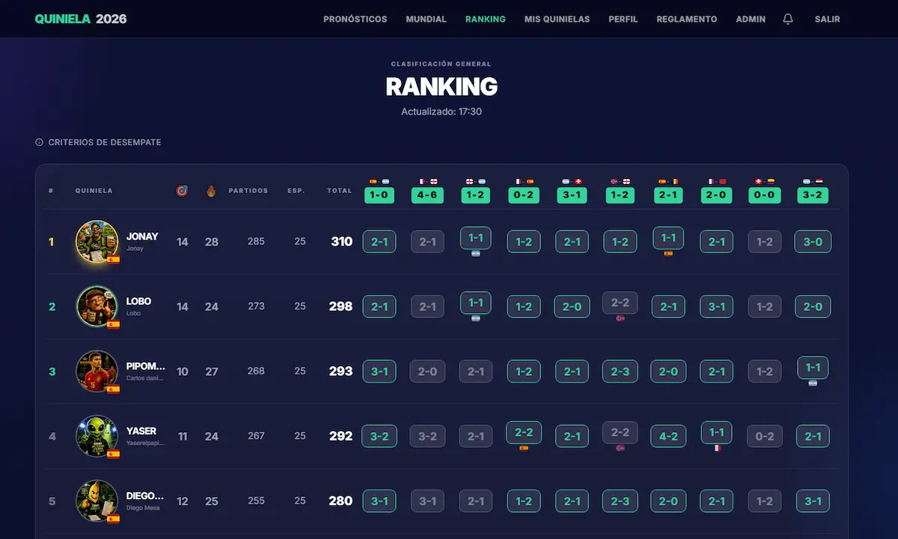
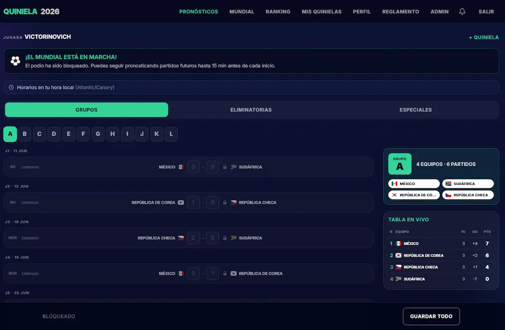
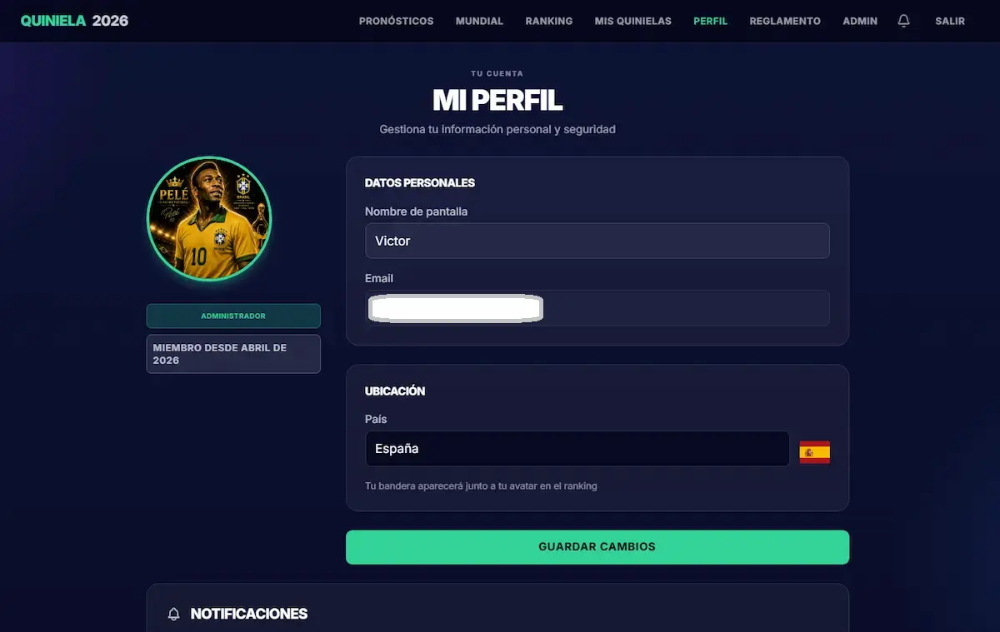
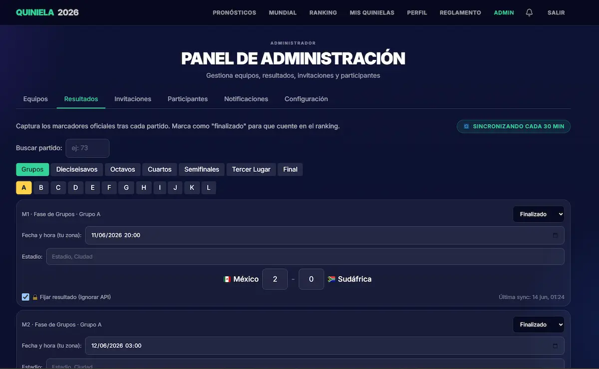
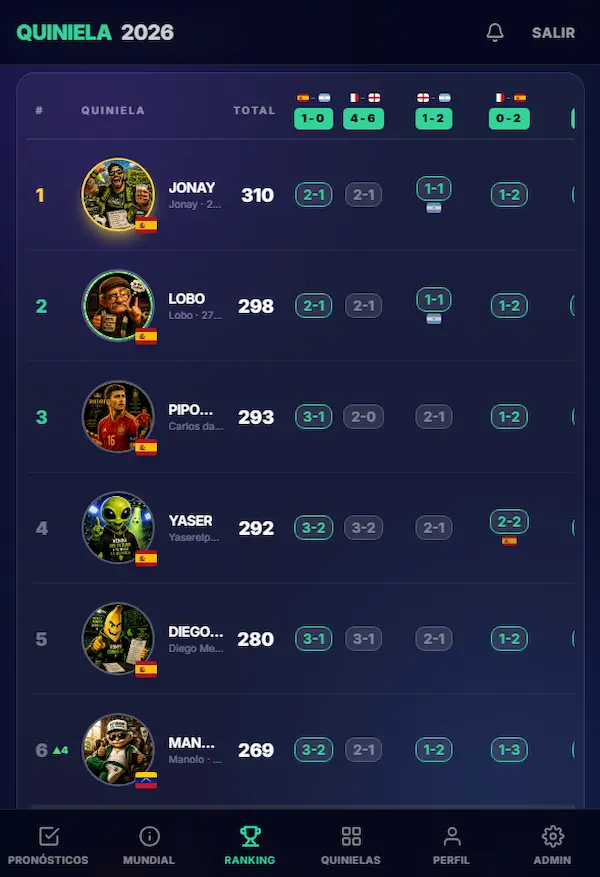

<div align="center">

# ⚽ Quiniela Mundial 2026

### Plataforma Web Profesional para Pronósticos Deportivos

[](https://nextjs.org/)
[](https://www.typescriptlang.org/)
[](https://supabase.com/)
[](https://tailwindcss.com/)
[](https://vercel.com/)
[](https://web.dev/progressive-web-apps/)

**Una aplicación web moderna, escalable y segura para gestionar quinielas del Mundial de Fútbol 2026.**

[[📖 Documentación](./docs/) • [🐛 Reportar Bug](#)

</div>

---

## 🎯 Descripción del Proyecto

**Quiniela Mundial 2026** es una **Progressive Web App (PWA)** full-stack diseñada para grupos privados que desean competir pronosticando los resultados del Mundial de Fútbol. La plataforma permite a cada usuario crear múltiples "jugadas" independientes, cada una con su alias y cuota, compitiendo en un ranking dinámico en tiempo real.

---

## 📸 Vista Previa

### 🖥️ Interfaz de Usuario

<div align="center">

| 🏠 Landing Page | 🏆 Ranking Dinámico |
| :---: | :---: |
|  |  |
| Sistema de login con códigos de invitación | Ranking en vivo con indicadores de tendencia ▲▼→ |

| ⚽ Pronósticos de Partidos | 📋 Perfil de Usuario |
| :---: | :---: |
|  |  |
| Interfaz intuitiva para pronosticar 104 partidos | Gestión de múltiples entries con alias únicos |

| 🔧 Panel de Administración | 📱 PWA Instalable |
| :---: | :---: |
|  |  |
| Gestión completa de partidos, equipos e invitaciones | Experiencia nativa en iOS/Android sin App Store |

</div>

---

### ✨ Características Principales

#### 🏆 **Sistema de Pronósticos Avanzado**
- **104 partidos**: 72 de fase de grupos + 32 de eliminatorias (R32 → Final)
- **Multi-jugada**: Cada usuario puede crear N entries con alias únicos
- **Predicciones especiales**: Campeón, Subcampeón, Goleador, MVP, Tercer Lugar
- **Bloqueo automático**: Los pronósticos se cierran al inicio del primer partido

#### 📊 **Ranking Dinámico Inteligente**
- Sistema de puntos configurable en tiempo real
- **6 niveles de desempate**: Puntos → Dif. Goles → Goles Favor → Enfrentamiento Directo → Alfabético → Menor ID
- **Indicadores de tendencia**: ▲ Subió / ▼ Bajó / → Mantiene posición
- Transparencia total: desglose de puntos por partido visible

#### 🎮 **Gamificación con Avatares Exclusivos**
- **4 niveles de avatares** desbloqueables por puntuación:
  - 🥉 **Básicos** (0-199 pts)
  - 🥈 **Expertos** (200-399 pts)
  - 🥇 **Maestros** (400-599 pts)
  - 👑 **Leyendas** (600+ pts)
- Sistema de progreso visual con barras y porcentajes

#### 📱 **PWA Instalable**
- **Instalación en dispositivos**: iOS, Android, Windows, macOS
- **Modo offline**: Consulta datos sin conexión
- **Notificaciones Push**: Alertas de actualizaciones de resultados (en desarrollo)
- **App-like experience**: Sin necesidad de App Store o Play Store

#### 🔄 **Sincronización Automática**
- Integración con **API oficial de FIFA** para resultados en tiempo real
- Actualización automática de marcadores vía cron jobs
- Historial de sincronizaciones visible en el panel de administración

#### 🎨 **Bracket de Eliminatorias Profesional**
- Cuadro simétrico de 7 columnas con conectores visuales
- Diseño responsivo con scroll horizontal en móviles
- Indicadores en vivo y estado de penales
- Alineación automática tipo "árbol" con justify-around

#### 🔐 **Seguridad de Nivel Empresarial**
- **Row Level Security (RLS)** en todas las tablas
- Validación server-side con `security_invoker = true`
- Backups automáticos diarios (Supabase)
- Roles diferenciados: Admin / Manager / Participant
- Cambio manual de contraseñas por admin (bypass de email)

#### 🌍 **Multi-zona Horaria**
- Cada usuario ve los partidos en su hora local
- Detección automática de timezone del browser
- Formato 12h/24h según preferencias regionales

#### 📧 **Sistema de Invitaciones**
- Códigos únicos generados por admin
- 1 uso por código, expirables
- Registro controlado y privado

#### 🎨 **Diseño FIFA-Style Dark Theme**
- Paleta `navy-deepest` + acentos `fifaGreen` + dorado
- Banderas reales de países (flagcdn.com)
- Tipografía Inter con tracking amplio
- Responsivo mobile-first

---

## 🛠️ Stack Tecnológico

### Frontend
- **Framework**: Next.js 14.2.15 (App Router, SSR, Server Components)
- **Lenguaje**: TypeScript 5.6.2 (strict mode)
- **Estilos**: Tailwind CSS 3.4.13 (dark theme custom)
- **UI/UX**: Componentes propios + animaciones CSS nativas

### Backend & Base de Datos
- **BaaS**: Supabase (PostgreSQL 17 + Auth + Realtime + Storage)
- **ORM**: Supabase Client (no Prisma ni ORMs pesados)
- **Auth**: Email/Password (sin OAuth, sin magic links)
- **Seguridad**: Row Level Security (RLS) en todas las tablas

### Infraestructura
- **Hosting**: Vercel (plan gratuito, edge functions)
- **CDN**: Vercel Edge Network + Flagcdn.com
- **Email**: Resend SMTP (custom para Supabase Auth)
- **Cron Jobs**: Vercel Cron (sincronización de resultados)

### Herramientas de Desarrollo
- **Control de versiones**: Git + GitHub
- **Linting**: ESLint + Prettier
- **Testing**: Manual + Validación de tipos TypeScript
- **Migrations**: SQL manual con numeración secuencial

---

## 📁 Estructura del Proyecto

```
quiniela-web/
├── .github/
│   └── copilot-instructions.md    ← Reglas para agentes IA
├── app/                           ← Páginas Next.js (App Router)
│   ├── layout.tsx                 ← Layout root con Navbar + BottomNav
│   ├── globals.css                ← Theme dark + componentes Tailwind
│   ├── page.tsx                   ← Landing pública
│   ├── predictions/               ← Pronósticos (SSR + Client)
│   ├── leaderboard/               ← Ranking dinámico
│   ├── entries/                   ← Gestión de jugadas
│   ├── tournament/                ← Tabla de grupos + Bracket
│   ├── admin/                     ← Panel administrativo
│   └── api/                       ← API Routes (cron, admin)
├── components/                    ← Componentes reutilizables
│   ├── Navbar.tsx
│   ├── BottomNav.tsx
│   └── Flag.tsx
├── lib/                           ← Lógica compartida
│   ├── supabase/                  ← Clientes (server, client, middleware)
│   ├── types.ts                   ← Tipos TypeScript del schema
│   └── standings.ts               ← Cálculos de ranking
├── migrations/                    ← Migraciones SQL (001-018+)
│   ├── 001_core_schema.sql
│   ├── 002_rls_policies.sql
│   ├── 005_seed_teams_and_matches.sql
│   └── 080_fix_knockout_scoring_logic.sql
├── docs/                          ← Documentación técnica
│   ├── ARCHITECTURE.md            ← Arquitectura completa
│   ├── DATABASE.md                ← Schema, RLS, migraciones
│   ├── STYLE_GUIDE.md             ← Design system completo
│   └── KNOWN_ISSUES.md            ← Bugs y features pendientes
├── CLAUDE.md                      ← Reglas para IA (detalladas)
└── README.md                      ← Este archivo
```

---

## 🏗️ Arquitectura

### Flujo de Datos

```
Usuario → Next.js SSR → Supabase (Auth + RLS) → PostgreSQL
                ↓
         Client Component (React) → Supabase Client → DB
                ↓
         Realtime Subscriptions (WebSocket)
```

### Capas de Seguridad

1. **Middleware**: Valida sesión en cada request (cookies SSR)
2. **RLS Policies**: Filtran datos a nivel de fila en PostgreSQL
3. **Server Components**: Queries iniciales con permisos del usuario
4. **Client Components**: Solo mutaciones permitidas por RLS
5. **API Routes**: Validación de rol (admin/manager) server-side

### Patrón de Componentes

- **Server Component** (`page.tsx`): Fetch inicial, SEO, performance
- **Client Component** (`*Client.tsx`): Interactividad, forms, realtime
- **Shared Components** (`components/`): Stateless, reutilizables

Más detalles: [📖 docs/ARCHITECTURE.md](./docs/ARCHITECTURE.md)

---

## 🚀 Instalación y Configuración

### Prerrequisitos

- Node.js ≥ 20
- Cuenta de Supabase (gratuita)
- Cuenta de Vercel (gratuita)
- Cuenta de Resend (opcional, para emails)

### 1. Clonar el repositorio

```bash
git clone https://github.com/tu-usuario/quiniela-web.git
cd quiniela-web
npm install
```

### 2. Configurar variables de entorno

Crear archivo `.env.local`:

```env
NEXT_PUBLIC_SUPABASE_URL=https://tu-proyecto.supabase.co
NEXT_PUBLIC_SUPABASE_ANON_KEY=tu_anon_key_publica
SUPABASE_SERVICE_ROLE_KEY=tu_service_role_key_privada
```

### 3. Aplicar migraciones

Desde el **SQL Editor de Supabase**, ejecutar en orden:

```sql
-- 001_core_schema.sql
-- 002_rls_policies.sql
-- 003_scoring_views.sql
-- ... (continuar hasta la última migración)
```

### 4. Seed de datos iniciales

```sql
-- 005_seed_teams_and_matches.sql (48 equipos + 104 partidos)
-- 008_real_teams_2026.sql (equipos reales del Mundial 2026)
```

### 5. Configurar Auth en Supabase

- **Desactivar** "Confirm email" (en Authentication > Settings)
- **Configurar** Resend SMTP (opcional):
  - SMTP Host: `smtp.resend.com`
  - SMTP Port: `465`
  - SMTP User: `resend`
  - SMTP Password: `tu_api_key_de_resend`

### 6. Ejecutar en desarrollo

```bash
npm run dev
```

Abrir [http://localhost:3000](http://localhost:3000)

### 7. Deploy a Vercel

```bash
vercel --prod
```

Configurar las mismas variables de entorno en el dashboard de Vercel.

---

## 📊 Estado del Proyecto

### ✅ Funcionalidades Completadas

- ✅ Sistema de autenticación completo (email/password)
- ✅ Registro con códigos de invitación
- ✅ Multi-jugada por usuario
- ✅ Pronósticos de 104 partidos + predicciones especiales
- ✅ Tabla de posiciones por grupo con enfrentamiento directo
- ✅ Ranking dinámico con 6 niveles de desempate
- ✅ Indicadores de tendencia (▲/▼/→)
- ✅ Sistema de avatares gamificado (4 niveles)
- ✅ Bracket de eliminatorias simétrico y profesional
- ✅ Panel de administración completo
- ✅ Sincronización automática con API de FIFA
- ✅ Cambio manual de contraseñas por admin
- ✅ Multi-zona horaria automática
- ✅ PWA instalable (manifest + service worker)
- ✅ RLS blindado en todas las tablas

### 🚧 En Desarrollo

- 🚧 Notificaciones Web Push
- 🚧 Integración con pasarelas de pago
- 🚧 Modo oscuro/claro (actualmente solo dark)
- 🚧 Tests automatizados (E2E con Playwright)

### 📋 Roadmap Futuro

- 📋 App nativa (React Native con mismo backend)
- 📋 Sistema de chat entre participantes
- 📋 Estadísticas avanzadas por usuario
- 📋 Exportar resultados a PDF/Excel
- 📋 Modo torneo customizable (otras competiciones)

Más detalles: [📖 docs/KNOWN_ISSUES.md](./docs/KNOWN_ISSUES.md)

---

## 📸 Capturas de Pantalla

### Landing Page


### Pronósticos


### Ranking Dinámico


### Bracket de Eliminatorias


---

## 🧪 Testing

### Ejecutar linting

```bash
npm run lint
```

### Build de producción

```bash
npm run build
```

### Validar tipos TypeScript

```bash
npx tsc --noEmit
```

---

## 🤝 Contribución

Este es un proyecto personal con fines educativos y de portfolio. Si deseas contribuir:

1. Fork el repositorio
2. Crea una rama: `git checkout -b feature/nueva-funcionalidad`
3. Commit: `git commit -m 'Add: nueva funcionalidad'`
4. Push: `git push origin feature/nueva-funcionalidad`
5. Abre un Pull Request

### Convenciones

- **Idioma**: UI en español, código/tipos en inglés
- **Commits**: Conventional Commits (Add, Fix, Update, Refactor)
- **Código**: Seguir reglas de `CLAUDE.md` y `docs/STYLE_GUIDE.md`
- **Ediciones quirúrgicas**: No reescribir archivos completos

---

## 📝 Licencia

Este proyecto es de código cerrado y pertenece a su autor. No se permite redistribución sin autorización explícita.

---

## 👤 Autor

**Desarrollador Full-Stack Especializado en Next.js + Supabase**

- Portfolio: Aun en construcción(#)
- GitHub: [@victorinovich1](https://github.com/victorinovich1)
- LinkedIn: [Victor Rodriguez](https://www.linkedin.com/in/victor-rodriguez-80494129/)
- Email: victorinovich@gmail.com

---

## �️ Restauración de Base de Datos

Para **clonar o restaurar** la base de datos completa del proyecto:

### 📦 Opción A: Schema consolidado (recomendado para portfolio)

El archivo **`schema.sql`** en la raíz contiene toda la estructura de la base de datos:

1. Abrir el proyecto Supabase
2. Ir a **SQL Editor**
3. Copiar el contenido de `schema.sql`
4. Pegar y ejecutar (toma ~30 segundos)
5. ✅ Listo: 11 tablas, 4 vistas, 4 funciones, RLS completo, 48 equipos

**Incluye:**
- ✅ DDL completo (todas las tablas con columnas finales)
- ✅ Vistas (match_scores, leaderboard, official_group_standings, best_thirds)
- ✅ Funciones (predictions_locked, is_admin, redeem_invite, etc.)
- ✅ RLS policies (seguridad a nivel de fila)
- ✅ Seed data (48 equipos, partidos de muestra, settings)

⚠️ **Nota:** El archivo incluye solo 10 partidos de muestra. Para cargar los **104 partidos completos**, ejecutar adicionalmente `migrations/056_official_fifa_104_matches.sql`.

### 📚 Opción B: Migraciones secuenciales (desarrollo)

Ejecutar las migraciones en orden numérico desde `migrations/`:

```bash
# Aplicar todas las migraciones en orden
001_core_schema.sql
002_rls_policies.sql
003_scoring_views.sql
...
080_fix_knockout_scoring_logic.sql
```

Cada migración está documentada y es idempotente (se puede ejecutar múltiples veces sin errores).

---

## �🙏 Agradecimientos

- **FIFA** por la inspiración del diseño
- **Flagcdn.com** por las banderas de países
- **Supabase** por su BaaS increíble
- **Vercel** por el hosting gratuito
- **Next.js Team** por el mejor framework React

---

<div align="center">

**⚽ Hecho con pasión por el fútbol y la tecnología ⚽**

Si te gusta este proyecto, dale una ⭐ en GitHub

</div>

