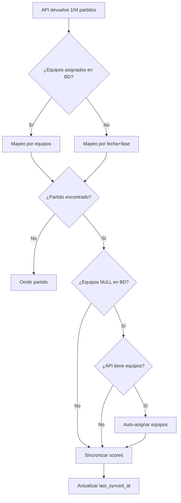
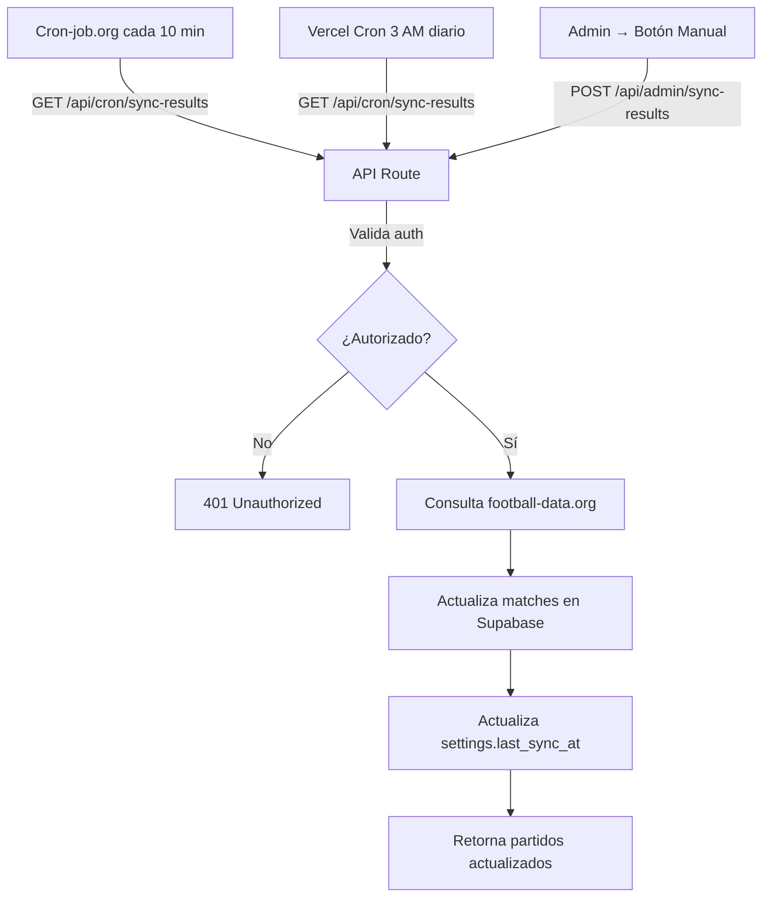

# Arquitectura

## Visión general

```
┌─────────────────────────────────────────────────────────────┐
│                       USUARIO (browser)                      │
│  [Pronósticos]  [Ranking]  [Mis Quinielas]  [Perfil]  [Admin]│
└──────────────────────────┬──────────────────────────────────┘
                           │ HTTPS
                           ▼
┌─────────────────────────────────────────────────────────────┐
│                    VERCEL (Next.js 14 SSR)                   │
│  - Server Components + Client Components                     │
│  - middleware.ts (auth guard)                                │
│  - @supabase/ssr (cookies-based session)                     │
└──────────────────────────┬──────────────────────────────────┘
                           │ HTTPS + JWT
                           ▼
┌─────────────────────────────────────────────────────────────┐
│                  SUPABASE (Postgres + Auth)                  │
│  - tables: profiles, entries, matches, teams, predictions...│
│  - RLS policies on every table                               │
│  - views (security_invoker): leaderboard, match_scores...    │
│  - RPCs: redeem_invite, validate_invite, is_admin, etc.      │
└──────────────────────────┬──────────────────────────────────┘
                           │ SMTP
                           ▼
                    ┌──────────────┐
                    │    RESEND    │  ← solo para reset password
                    │  (free tier) │
                    └──────────────┘
```

## Flujo típico de un usuario

### Registro
1. Usuario va a `/signup`
2. Llena email + contraseña + nombre + código de invitación
3. Frontend llama `validate_invite(code, email)` (RPC) → bool
4. Si válido → `supabase.auth.signUp({ email, password })`
5. Trigger `handle_new_user` crea perfil en `profiles` (rol = 'admin' si email coincide con el admin hardcodeado, sino 'participant')
6. Frontend llama `redeem_invite(code)` para marcar el código como usado
7. Frontend hace UPDATE a `profiles.display_name` con el nombre dado
8. Redirect a `/entries` para crear primera quiniela

### Login
1. Usuario va a `/login`
2. Email + contraseña → `supabase.auth.signInWithPassword`
3. Cookie de sesión se setea automáticamente
4. Redirect a `/predictions`

### Recuperación de contraseña
1. Usuario va a `/forgot-password` (o admin usa botón en `/admin` → Participantes)
2. Ingresa email → `supabase.auth.resetPasswordForEmail(email, { redirectTo: origin + '/auth/callback?next=/reset-password' })`
3. Supabase envía email vía SMTP (Resend) con enlace que contiene código de un solo uso
4. Usuario hace clic en enlace del email → `/auth/callback?code=XXX&next=/reset-password`
5. Callback ejecuta `supabase.auth.exchangeCodeForSession(code)` → crea sesión temporal de recovery
6. Callback redirige a `/reset-password`
7. Página verifica sesión activa (evento `PASSWORD_RECOVERY`)
8. Usuario ingresa nueva contraseña → `supabase.auth.updateUser({ password: newPassword })`
9. Contraseña actualizada, redirect a `/predictions`

**Notas:**
- Enlace de recuperación expira en 1 hora
- Si Resend está en plan free, emails solo llegan al correo verificado (el admin puede enviarlos manualmente)
- El código se intercambia por sesión en server-side (seguro)
- La sesión de recovery permite solo cambiar la contraseña, no acceso completo

### Pronosticar
1. `/predictions` (server component) carga del usuario:
   - Sus entries
   - Todos los teams y matches
   - Sus predictions de la entry activa (?entry=N)
   - Sus special_predictions de esa entry
   - El estado del bloqueo (`predictions_locked()` RPC)
2. Pasa todo como props al `PredictionsClient` (client component)
3. Usuario llena marcadores → estado local
4. Click "Guardar" → upsert masivo en `predictions` y `special_predictions` con `entry_id`

### Ver ranking
1. `/leaderboard` (server component) lee la view `leaderboard` ordenada por `total_points DESC`
2. La view recalcula puntos cada vez que se consulta (no hay cache)
3. Punto fuerte: los puntos siempre reflejan el estado actual (resultados + scoring config)

### Gestionar perfil
1. `/profile` permite al usuario gestionar su cuenta:
   - Cambiar nombre de pantalla (display_name)
   - Cambiar contraseña
   - Ver información de la cuenta (rol, fecha de creación)
2. **Zona de Peligro** al final de la página:
   - Botón "Eliminar mi cuenta" (permanente, borra todas las quinielas y pronósticos)
   - **Solo permitido antes de `lock_at`** — una vez iniciado el torneo, el botón se deshabilita
   - Tras confirmación doble, llama a RPC `delete_user_self()` que valida permisos y elimina en cascada
   - Cierra sesión automáticamente y redirige a la landing page

### Gestionar quinielas (entries)
1. `/entries` muestra todas las quinielas (participaciones) del usuario
2. Cada quiniela tiene:
   - **Alias único** (ej: "Casa", "Oficina", "Conservadora")
   - Estado de pago (pagada/pendiente) — marcado por el admin
   - Fecha de creación
   - Pronósticos independientes
3. Usuarios pueden:
   - **Crear nuevas quinielas** (si el torneo no ha empezado)
   - **Editar el alias** de quinielas existentes (botón de lápiz junto al nombre)
   - **Eliminar quinielas** (solo si el torneo no ha empezado)
   - Navegar a `/predictions?entry=N` para llenar pronósticos
4. Cada quiniela compite independientemente en el ranking
5. Cada quiniela paga su propia cuota (marcada manualmente por el admin)

**Restricciones:**
- Alias deben ser únicos por usuario
- No se pueden crear/editar/eliminar quinielas después de `lock_at`
- RLS asegura que solo el usuario pueda modificar sus propias quinielas

## Páginas y guard de auth

`middleware.ts` protege estas rutas:
- `/predictions` → requiere autenticación
- `/leaderboard` → requiere autenticación
- `/entries` → requiere autenticación
- `/profile` → requiere autenticación (gestión de perfil y cambio de contraseña)
- `/admin` → requiere autenticación + rol admin (validado en el server component también)

Si no autenticado, redirige a `/login?next=<ruta_original>`.

## Capacidades administrativas

El panel `/admin` ofrece control completo del sistema al rol `admin`:

### Gestión de Equipos
- Editar nombres de los 48 equipos según el sorteo oficial
- Ver banderas automáticas vía flagcdn.com (iso_code)

### Gestión de Resultados
- Capturar marcadores oficiales tras cada partido
- Marcar partidos como "finalizado" para que cuenten en el ranking
- Editar fechas, estadios y detalles de partidos
- Manejar ganadores por penales en eliminatorias

### Gestión de Invitaciones
- Generar códigos únicos de invitación
- Opcionalmente restringir códigos a emails específicos
- Ver estado de invitaciones (usadas/disponibles)

### Gestión de Participantes
- Ver todas las quinielas (entries) de cada usuario
- Marcar quinielas como pagadas/pendientes
- Cambiar roles (admin/manager/participant)
  - **admin**: Acceso completo al panel de administración
  - **manager**: Acceso restringido (solo Invitaciones y Participantes, sin permisos de edición)
  - **participant**: Usuario normal sin acceso al panel de administración
- **Enviar correos de recuperación de contraseña**: Botón de "sobre" junto a cada usuario permite enviar email de reset password directamente (útil cuando Resend está en plan free y solo envía a email verificado)
- **Eliminar usuarios**: Botón de papelera roja elimina permanentemente al usuario y todas sus quinielas (en cascada). No requiere que el torneo haya iniciado.
- **Eliminar quinielas individuales**: Botón de papelera en cada quiniela permite eliminar una entry específica sin borrar al usuario

### Configuración del Sistema
- Establecer fecha/hora de cierre de pronósticos (`lock_at`)
- Configurar sistema de puntos (12 categorías editables)
- Cargar resultados especiales al final del torneo (campeón, subcampeón, tercer y cuarto lugar)

Todos los cambios en configuración y resultados actualizan el ranking automáticamente gracias a las views calculadas en tiempo real.

## Bloqueo de pronósticos

El sistema implementa un **bloqueo dual** para máxima flexibilidad:

### 1. Bloqueo Global (`settings.lock_at`)
Afecta solo a:
- **Predicciones especiales (podio)**: Los 4 selectores (campeón, subcampeón, 3º, 4º) se bloquean al llegar a `lock_at`
- **Borrado de quinielas (entries)**: No se pueden eliminar entries después de `lock_at`

**Implementación:**
- Función SQL `predictions_locked()` retorna `lock_at < now()`
- RLS de `special_predictions`: bloquea UPDATE si `predictions_locked() = true`
- RLS de `entries`: bloquea DELETE si `predictions_locked() = true`
- Frontend: Calcula `podiumLocked` y deshabilita selectores del podio
- UI muestra advertencia: "⚠️ El podio se bloquea definitivamente al iniciar el mundial"

### 2. Bloqueo por Partido (15 minutos antes de kickoff)
Afecta solo a:
- **Marcadores individuales de cada partido**: Cada partido se bloquea 15 min antes de su `kickoff_at`

**Implementación:**
- Función `isMatchLocked(match, globalLocked)` en frontend retorna:
  - `true` si `Date.now() >= (kickoff - 15 min)` 
  - O si `globalLocked = true` (fallback legacy)
- Inputs de score se deshabilitan individualmente cuando `isMatchLocked = true`
- Permite pronosticar partidos futuros incluso si otros ya comenzaron
- RLS valida que no haya pasado el `lock_at` global (protección adicional)

**Bloqueo dinámico de eliminatorias:**
- En UI, los inputs de score de eliminatorias están deshabilitados si los equipos aún no se definen (`home_team_id` o `away_team_id` NULL)
- Muestra mensaje "Esperando rivales..." o pill opaco hasta que se completen las rondas previas
- Admin puede asignar equipos manualmente en la pestaña Resultados cuando se definan los clasificados

**Resumen:**
| Elemento | Bloqueado por | Momento del bloqueo |
|----------|--------------|---------------------|
| Podio (campeón, subcampeón, 3º, 4º) | `lock_at` global | Al iniciar el primer partido |
| Borrado de jugadas (entries) | `lock_at` global | Al iniciar el primer partido |
| Marcadores de partidos individuales | `kickoff_at - 15 min` | Por partido, 15 min antes |

## Estado Virtual de Partidos

El sistema implementa **estado virtual** para mejorar la UX sin depender de la API externa:

### Lógica de Estado Virtual

**Función centralizada:** `getMatchStatus(match)` en `lib/utils.ts`

```typescript
function getMatchStatus(match: Match): 'finished' | 'live' | 'scheduled' {
  if (match.status === 'finished') return 'finished'
  if (match.status === 'live') return 'live'
  
  // Estado virtual: si llegó kickoff_at pero status='scheduled'
  if (match.kickoff_at && Date.now() >= new Date(match.kickoff_at).getTime()) {
    return 'live'  // Virtualmente en vivo
  }
  
  return 'scheduled'
}
```

**Función de marcadores:** `getMatchScores(match)` en `lib/utils.ts`

```typescript
function getMatchScores(match: Match): [number | null, number | null] {
  // Si tiene marcador oficial, usar ese
  if (match.home_score !== null && match.away_score !== null) {
    return [match.home_score, match.away_score]
  }
  
  // Si es virtualmente en vivo, mostrar 0-0
  if (getMatchStatus(match) === 'live') {
    return [0, 0]
  }
  
  // Aún no comienza
  return [null, null]
}
```

### Componentes que usan estado virtual

Todos los componentes que muestran partidos usan las funciones centralizadas:

- **`app/leaderboard/LeaderboardClient.tsx`**: Muestra badge "EN VIVO" cuando `getMatchStatus() === 'live'`
- **`app/admin/AdminClient.tsx`**: Muestra badge "VIVO (Virtual)" cuando kickoff pasó pero status='scheduled'
- **`app/predictions/components/FifaMatchRow.tsx`**: Badge rojo "EN VIVO" parpadeante
- **`app/predictions/components/CompactMatchRow.tsx`**: Badge "VIVO" compacto

### Beneficios

1. **UX inmediata**: Partidos se marcan como "en vivo" exactamente a su hora programada
2. **Marcador 0-0 placeholder**: Los usuarios ven que el partido ya comenzó aunque la API no haya sincronizado
3. **Sin dependencia crítica de API**: El sistema funciona incluso si la API falla o tiene latencia
4. **Sincronización eventual**: Cuando la API retorne datos reales, el marcador se actualiza

## Página de Resumen de Resultados

**Ruta:** `/predictions/summary`

Vista de solo lectura que muestra el estado actual de todos los partidos del torneo con:

- **Partidos finalizados**: Marcador oficial
- **Partidos en vivo**: Estado virtual (EN VIVO) con marcador real o 0-0
- **Partidos programados**: Fecha y hora

**Características:**
- Organizada por fase (Grupos, Dieciseisavos, Octavos, etc.)
- Diseño compacto optimizado para consulta rápida
- No hay inputs ni edición (solo vista)
- Accesible desde el menú principal

**Uso:** Útil para que usuarios consulten resultados sin navegar a sus pronósticos.

## Sincronización Híbrida de Resultados

El sistema sincroniza resultados de partidos desde la API externa (football-data.org) usando un enfoque híbrido de 3 capas:

### 1. Cron Job Diario (Vercel)

**Archivo:** `vercel.json`

```json
{
  "crons": [{
    "path": "/api/cron/sync-results",
    "schedule": "0 3 * * *"
  }]
}
```

- **Frecuencia**: Diariamente a las 3:00 AM UTC
- **Propósito**: Sincronización de mantenimiento (resultados finales confirmados)
- **Limitación**: Máximo 2 cron jobs en plan Hobby de Vercel

### 2. Cron Job Frecuente (Cron-job.org)

**Servicio externo:** [cron-job.org](https://cron-job.org)

- **Frecuencia**: Cada 10 minutos durante días de partidos
- **URL objetivo**: `https://tu-dominio.vercel.app/api/cron/sync-results`
- **Header requerido**: `Authorization: Bearer CRON_SECRET`
- **Propósito**: Sincronización en tiempo casi real durante el torneo
- **Configuración**: Admin debe crear la tarea en cron-job.org apuntando a la API

### 3. Sincronización Manual (Admin)

**Panel Admin → Resultados → Botón "Sincronizar ahora"**

- **Uso**: Sincronización inmediata bajo demanda
- **Endpoint**: `POST /api/admin/sync-results`
- **Validación**: Requiere `is_admin()` y sesión activa
- **UI Feedback**: 
  - Indicador de carga mientras procesa
  - Mensajes de éxito/error
  - Timestamp de última sincronización (`settings.last_sync_at`)
  - Lista de partidos recién actualizados

### Endpoint de Sincronización

**`GET|POST /api/cron/sync-results`**

**Autenticación:** 
- Header `Authorization: Bearer CRON_SECRET` (para crons externos)
- O sesión admin válida (para botón manual)

**Proceso:**
1. Valida autenticación (cron secret o admin session)
2. Consulta API de football-data.org con `FOOTBALL_DATA_API_KEY`
3. Itera partidos `status='live'` o `finished` recientes
4. Para cada partido:
   - Extrae `home_score`, `away_score`, `status`
   - Si hay penales: extrae `shootout_winner`
5. Hace `UPDATE` en `matches` usando `SUPABASE_SERVICE_ROLE_KEY`
6. Actualiza `settings.last_sync_at = now()`
7. Retorna JSON con partidos actualizados

**Variables de entorno requeridas:**
```env
FOOTBALL_DATA_API_KEY=tu_api_key_de_football_data
SUPABASE_SERVICE_ROLE_KEY=tu_service_role_key
CRON_SECRET=un_secreto_aleatorio_largo
```

### Mapeo Híbrido de Partidos

El sistema usa una **estrategia dual** para emparejar partidos de la API con la base de datos, permitiendo sincronizar los 104 partidos del torneo (72 de grupos + 32 de eliminatorias):

#### 1. Mapeo por Equipos (Fase de Grupos)
- **Condición:** Ambos equipos asignados en BD (`home_team_id` y `away_team_id` no NULL)
- **Clave:** `${home_team_id}-${away_team_id}`
- **Cobertura:** 72 partidos de fase de grupos
- **Ventaja:** Preciso y rápido (hash map directo)

#### 2. Mapeo por Fecha + Fase (Eliminatorias)
- **Condición:** Cuando mapeo por equipos falla (equipos NULL o no encontrados)
- **Clave:** `${stage}-${kickoff_at}` (con margen de ±1 minuto)
- **Cobertura:** 32 partidos de eliminatorias
- **Ventaja:** Funciona incluso antes de que se definan los clasificados

**Lógica de selección:**
```typescript
// 1. Intentar mapeo por equipos (si ambos códigos existen en la API)
if (homeCode && awayCode && extHomeId && extAwayId) {
  mapped = matchByTeams.get(`${extHomeId}-${extAwayId}`)
}

// 2. Si falla, intentar mapeo por fecha+fase
if (!mapped && fm.utcDate && fm.stage) {
  for (const [key, m] of matchByDateStage) {
    const [stage, dateStr] = key.split('-', 2)
    if (stage !== apiStage) continue
    
    const diffMinutes = Math.abs(apiDate - dbDate) / (1000 * 60)
    if (diffMinutes <= 1) {
      mapped = m
      break
    }
  }
}
```

#### 3. Auto-Asignación de Equipos

**Gatillo:** Cuando un partido en BD tiene equipos NULL pero la API ya definió los clasificados

**Proceso:**
1. Detecta que `mapped.home_team_id` o `mapped.away_team_id` son NULL
2. API devuelve códigos de equipos (ej: 'ARG', 'BRA')
3. Busca IDs en tabla `teams` usando `teamByCode` Map
4. Ejecuta UPDATE en tabla `matches`:
   ```sql
   UPDATE matches 
   SET home_team_id = ?, away_team_id = ?
   WHERE id = ?
   ```
5. Incrementa contador `autoAssignedTeams` en la respuesta

**Resultado:**
- ✅ Los pronósticos se habilitan automáticamente para ese partido
- ✅ Los usuarios ven los equipos reales en lugar de "Por definir"
- ✅ El ranking recalcula incluyendo ese partido
- ✅ No requiere intervención manual del admin

**Ejemplo de flujo:**



**Estadísticas de sincronización:**
- `upstreamCount`: Total de partidos recibidos de la API (104)
- `updated`: Partidos sincronizados (scores/status actualizados)
- `autoAssignedTeams`: Equipos auto-asignados en eliminatorias
- `skippedNoMapping`: Partidos no encontrados en BD
- `skippedUnknownCode`: Equipos con códigos desconocidos

### Configuración en Admin

El panel de administración muestra:

- **Última sincronización**: Timestamp de `settings.last_sync_at`
- **API Key**: Estado configurada/no configurada (sin mostrar valor)
- **Interval de sync**: Editable en minutos (`settings.sync_interval_minutes`)
- **Últimos partidos sincronizados**: Lista de matches con `last_synced_at` reciente

**Sección de configuración permite:**
- Ver el intervalo actual de sincronización automática
- Modificar el intervalo (ej. de 10 a 15 minutos)
- Ver timestamp de última sync exitosa
- Ejecutar sincronización manual inmediata

### Flujo Completo



### Manejo de Errores

- **API key faltante**: Retorna error 500, no sincroniza
- **API externa caída**: Retorna error 502, logs el problema
- **Cron secret inválido**: Retorna 401, no ejecuta
- **Timeout de API**: Límite de 10 segundos, retorna error parcial

## Sistema de Avatares por Niveles

El sistema incluye un **sistema de gamificación** donde los usuarios desbloquean avatares premium según su desempeño en el torneo:

### 4 Categorías de Avatares

| Categoría | Cantidad | Requisitos | Disponibilidad |
|-----------|----------|------------|----------------|
| **Básicos** | 39 | Ninguno | Siempre desbloqueados |
| **Especiales** | 12 | Puntos >= X **O** Exactos >= Y | Desbloqueables |
| **Premium** | 12 | Puntos >= X **O** Exactos >= Y | Desbloqueables |
| **Leyendas** | 12 | Puntos >= X **O** Exactos >= Y | Desbloqueables |

**Total:** 75 avatares disponibles

### Configuración de Requisitos

Los umbrales son configurables desde el Panel Admin:

**Tabla `settings`:**
- `req_pts_special` (default: 30 puntos)
- `req_exact_special` (default: 3 marcadores exactos)
- `req_pts_premium` (default: 70 puntos)
- `req_exact_premium` (default: 7 marcadores exactos)
- `req_pts_legend` (default: 120 puntos)
- `req_exact_legend` (default: 12 marcadores exactos)

### Lógica de Desbloqueo

**Condición OR:** Se desbloquea si cumple **CUALQUIERA** de los dos requisitos:

```typescript
const unlockSpecial = (totalPoints >= req_pts_special) || (exactCount >= req_exact_special)
const unlockPremium = (totalPoints >= req_pts_premium) || (exactCount >= req_exact_premium)
const unlockLegend = (totalPoints >= req_pts_legend) || (exactCount >= req_exact_legend)
```

**Ejemplo:** Si un usuario tiene:
- 25 puntos totales
- 4 marcadores exactos

Con configuración default (30 pts O 3 exactos):
- ✅ Desbloquea **Especiales** (4 >= 3)
- ❌ No desbloquea **Premium** (25 < 70 y 4 < 7)

### Almacenamiento en Base de Datos

**Tabla `profiles`:**
- `avatar_perm_id` (int): ID del avatar seleccionado (1-75)
- `avatar_category` (text): Categoría del avatar ('permanentes', 'especiales', 'premium', 'leyendas')
- `country_code` (text): Código ISO del país del usuario (para bandera en ranking)

**View `leaderboard`:**
- Incluye `exact_count`: Conteo de marcadores exactos para validar desbloqueos
- Construcción dinámica de `display_avatar`: `/images/avatars/{category}/{id}.webp`

### Restricción de Unicidad

**Constraint:** `profiles_avatar_category_id_unique`

Permite que el **mismo ID** exista en **diferentes categorías**:
- ID 1 de "Básicos" ≠ ID 1 de "Especiales"
- Construcción del path: `/{category}/{id}.webp`

### Formato de Imágenes

**Todas las imágenes en formato WebP:**
- Ruta: `/public/images/avatars/{category}/{id}.webp`
- Reducción de tamaño: ~30-50% vs PNG/JPG
- Fallback: `default.webp` si falla la carga

**Componente:** `lib/avatars.ts`
```typescript
export const AVATAR_PATHS = {
  permanent: (id: number) => `/images/avatars/permanentes/${id}.webp`,
  default: '/images/avatars/default.webp',
}
```

### UI del Selector de Avatares

**Componente:** `app/profile/ProfileClient.tsx`

**Características:**
- **Carrusel horizontal** con scroll snap
- **Navegación con flechas** (ChevronLeft/ChevronRight) solo en desktop
- **Scroll con rueda del mouse** (onWheel handler convierte vertical a horizontal)
- **Scrollbar estilizado** en desktop (oculto en mobile)
- **Indicadores visuales:**
  - Borde verde `border-fifaGreen` para avatar seleccionado
  - Candado 🔒 para avatares bloqueados
  - Opacidad reducida para avatares no disponibles
  - Checkmark ✓ sobre avatar activo

**Texto de requisitos:**
```
Requiere de X ptos o acertar Y marcadores exactos
```

**Padding ajustado:** `px-10 md:px-12` para que las flechas no tapen avatares

### Configuración desde Admin

**Panel Admin → Configuración → Avatares por Niveles**

3 secciones:
1. **Especiales** — Inputs para pts y exactos
2. **Premium** — Inputs para pts y exactos
3. **Leyendas** — Inputs para pts y exactos

Guardado instantáneo al hacer clic en "Guardar".

### Migración de Datos

**Migración 046:** `configurable_avatar_tiers.sql`
- Añade 6 columnas a `settings` (requisitos)
- Añade `avatar_category` a `profiles`
- Recrea view `leaderboard` con `exact_count`

**Migración 047:** `fix_avatar_uniqueness_by_category.sql`
- Elimina constraint `profiles_avatar_perm_id_unique`
- Crea constraint `profiles_avatar_category_id_unique` sobre `(avatar_category, avatar_perm_id)`

## Sistema de Banderas de País

Los usuarios pueden seleccionar su país de origen desde su perfil (`/profile`):

### Implementación

**Tabla `profiles`:**
- `country_code` (text): Código ISO alpha-2 del país (ej. 'mx', 'ar', 'us')

**Componente:** `lib/countries.ts`
```typescript
export const COUNTRIES = [
  { code: 'mx', name: 'México' },
  { code: 'ar', name: 'Argentina' },
  // ... 200+ países
]
```

### Visualización

- **En Perfil**: Dropdown con todos los países, preview de bandera al seleccionar
- **En Ranking**: Bandera pequeña junto al avatar del usuario (usando `<Flag />` con `iso_code=country_code`)
- **Formato:** Banderas de `flagcdn.com` con código ISO

### Funcionalidad

**Opcional:** El usuario puede dejar el campo vacío (sin país seleccionado)

**Guardado:** Junto con `display_name` y `avatar_perm_id` al hacer clic en "Guardar cambios"

**RLS:** Solo el propio usuario puede editar su `country_code`

## Timestamp en Vivo

**Componente:** `components/LiveTimestamp.tsx`

Muestra la hora actual del dispositivo del usuario en formato `HH:mm`, actualizada cada minuto.

**Uso:** Aparece en `/leaderboard` con el texto:
```
Actualizado: 14:32
```

**Implementación:**
```typescript
const [time, setTime] = useState('')

useEffect(() => {
  const updateTime = () => {
    const now = new Date()
    setTime(now.toLocaleTimeString('es-ES', { 
      hour: '2-digit', 
      minute: '2-digit' 
    }))
  }
  
  updateTime()
  const interval = setInterval(updateTime, 60000)
  
  return () => clearInterval(interval)
}, [])
```

**Beneficio:** Los usuarios ven que el ranking está "vivo" y actualizado, sin necesidad de recargar manualmente.

## Estadios Oficiales

Los 104 partidos del Mundial 2026 tienen asignados sus estadios y ciudades oficiales según el calendario FIFA:

### Implementación

**Migración 048:** `populate_stadium_names.sql`
- 104 sentencias `UPDATE matches SET stadium = '...' WHERE match_number = N`
- Datos oficiales de: [FIFA.com](https://www.fifa.com/es/tournaments/mens/worldcup/canadamexicousa2026)

**Formato del campo `stadium`:**
```
Estadio Nombre, Ciudad
```

**Ejemplos:**
- `Estadio Ciudad de México, Ciudad de México`
- `Estadio BC Place Vancouver, Vancouver`
- `Estadio Nueva York Nueva Jersey, Nueva York/Nueva Jersey`

### 16 Estadios en 3 Países

**México (3):**
- Ciudad de México (Estadio Azteca)
- Guadalajara (Estadio Akron)
- Monterrey (Estadio BBVA)

**Canadá (2):**
- Toronto (BMO Field)
- Vancouver (BC Place)

**USA (11):**
- Los Ángeles (SoFi Stadium)
- San Francisco Bay (Levi's Stadium)
- Nueva York/Nueva Jersey (MetLife Stadium)
- Boston (Gillette Stadium)
- Houston (NRG Stadium)
- Dallas (AT&T Stadium)
- Filadelfia (Lincoln Financial Field)
- Atlanta (Mercedes-Benz Stadium)
- Seattle (Lumen Field)
- Miami (Hard Rock Stadium)
- Kansas City (Arrowhead Stadium)

### Visualización

**Componentes:**
- **`FifaMatchRow`**: Muestra ciudad + estadio en columna derecha (desktop only)
- **`CompactMatchRow`**: Muestra ciudad abreviada (desktop only)

**Procesamiento:**
```typescript
const stadium = match.stadium || ''
const stadiumParts = stadium.split(',').map(s => s.trim())
const cityShort = stadiumParts[1] || stadiumParts[0] || ''
const venueShort = stadiumParts[0] || ''
```

**Regla de visibilidad:** `hidden md:block` — Los estadios solo aparecen en pantallas medianas o mayores para no saturar la UI móvil.

## Optimizaciones Técnicas

### Eliminación de Errores de Hidratación

**Problema:** Fechas y timestamps generados en servidor (`Date.now()`) no coinciden con cliente al milisegundo, causando warning #423.

**Solución aplicada:**

1. **AdminClient.tsx:**
```typescript
// ❌ ANTES
const [currentTime, setCurrentTime] = useState(Date.now())

// ✅ AHORA
const [currentTime, setCurrentTime] = useState(0)

useEffect(() => {
  setCurrentTime(Date.now())  // Inicializa en cliente
  const interval = setInterval(() => {
    setCurrentTime(Date.now())
  }, 1000)
  return () => clearInterval(interval)
}, [])
```

2. **LeaderboardClient.tsx:** Mismo patrón para evitar mismatch server/client en timestamps.

**Resultado:** Eliminación total de errores de hidratación relacionados con tiempo.

## Estrategia de Backups

La quiniela implementa un sistema de respaldo automático que opera independientemente de máquinas locales, garantizando la preservación de datos críticos.

### Sistema de Backups Diarios

**Implementación:** GitHub Actions (`.github/workflows/daily-backup.yml`)

**Configuración:**
- **Frecuencia:** Diario a las 03:00 AM UTC
- **Retención:** 90 días
- **Almacenamiento:** GitHub Artifacts
- **Ejecución:** Servidor de GitHub (ubuntu-latest)

**Proceso automatizado:**

1. GitHub Actions inicia el flujo de trabajo según el cron schedule
2. Instala el cliente de PostgreSQL en la VM temporal
3. Ejecuta `scripts/backup-db.sh` con la connection string de Supabase
4. El script exporta solo las tablas críticas del esquema `public`:
   - `profiles` — Usuarios y configuración de perfil
   - `entries` — Quinielas/participaciones
   - `matches` — Calendario de partidos
   - `teams` — Equipos del torneo
   - `predictions` — Pronósticos de todos los partidos
   - `special_predictions` — Predicciones especiales (campeón, subcampeón, etc.)
   - `settings` — Configuración global
   - `invitations` — Códigos de invitación
5. Comprime el dump en formato `.zip` con timestamp
6. Almacena el archivo como artifact de GitHub con nombre `quiniela-backup-{run_number}`

**Tamaño estimado:** ~500 KB - 2 MB (comprimido) dependiendo de la cantidad de pronósticos.

### Acceso a los Backups

**Para restaurar o consultar un backup:**

1. Ir a: `https://github.com/{tu-usuario}/quiniela-web/actions/workflows/daily-backup.yml`
2. Seleccionar la ejecución deseada (por fecha)
3. Descargar el artifact desde la sección "Artifacts"
4. Descomprimir el archivo `.zip`
5. Restaurar con: `psql $SUPABASE_DB_URL < quiniela_backup_YYYYMMDD_HHMMSS.sql`

**Ejecución manual:** El workflow puede dispararse manualmente desde la pestaña "Actions" en GitHub usando el botón "Run workflow".

### Configuración Requerida

## Sistema de Notificaciones

**Objetivo:** Mantener a los usuarios informados sobre eventos importantes del torneo mediante alertas en tiempo real.

### Arquitectura

```
┌─────────────────────────────────────────────────────────────┐
│                    FUENTES DE NOTIFICACIONES                 │
├─────────────────────────────────────────────────────────────┤
│ 1. Admin manual (NotificationsTab)                          │
│ 2. Sync automático (partidos finalizados)                   │
│ 3. Futuros: Recordatorios, ranking updates, etc.            │
└──────────────────────┬──────────────────────────────────────┘
                       │ INSERT
                       ▼
        ┌──────────────────────────────┐
        │  TABLE: notifications        │
        │  - user_id (FK profiles)     │
        │  - title, message, type      │
        │  - read (boolean)            │
        │  - created_at                │
        └──────────────┬───────────────┘
                       │ Supabase Realtime (broadcast)
                       ▼
        ┌──────────────────────────────┐
        │  NotificationBell.tsx        │
        │  - Suscripción vía channel   │
        │  - Badge con contador        │
        │  - Dropdown con últimas 10   │
        │  - Audio opcional            │
        └──────────────────────────────┘
```

### Componentes Principales

#### 1. **Tabla `notifications`**
- **RLS:** Usuarios solo ven sus propias notificaciones
- **Auto-limpieza:** Trigger que mantiene máximo 15 notificaciones por usuario
- **Realtime:** Habilitado vía `alter publication supabase_realtime add table notifications`

#### 2. **Preferencias de Usuario**
- `profiles.notifications_enabled`: Activar/desactivar alertas
- `profiles.notifications_sound`: Reproducir sonido al recibir

#### 3. **NotificationBell (components/NotificationBell.tsx)**
- **Campana en Navbar:** Icono con badge rojo mostrando cantidad no leídas
- **Realtime:** Suscripción a `postgres_changes` en tabla notifications
- **Dropdown:** Lista de últimas 10 notificaciones (leídas + no leídas)
- **Audio:** Reproduce `/sounds/notification.mp3` al recibir nueva (solo si habilitado)
- **Interacción:** Click → marca como leída, navega a `link` si existe

#### 4. **Panel Admin (NotificationsTab)**
- **Envío masivo:** Opción "Todos" o "Usuario específico"
- **Campos:** Título, mensaje
- **Lógica:** INSERT directo a tabla `notifications` con `user_id` destino

#### 5. **Notificaciones Automáticas**
- **Partido finalizado:** Cuando sync-results detecta `status='finished'` por primera vez, inserta notificación a todos los usuarios con `notifications_enabled=true`
- **Mensaje:** "⚽ Partido finalizado: {equipo_local} {score} {equipo_visitante}"
- **Link:** `/leaderboard` para ver cambios en ranking

### Flujo de una Notificación

1. **Evento disparador:**
   - Admin envía notificación desde panel
   - Sync detecta partido finalizado
   - (Futuro) Cron detecta partido próximo sin pronóstico

2. **INSERT a `notifications`:**
   ```sql
   INSERT INTO notifications (user_id, title, message, type, link)
   VALUES ('uuid-usuario', '⚽ Partido finalizado', 'MEX 2-1 ARG', 'match_update', '/leaderboard')
   ```

3. **Trigger auto-limpieza:**
   - Si usuario tiene > 15 notificaciones, borra las más antiguas

4. **Supabase Realtime:**
   - Emite evento a todos los clientes suscritos
   - Solo el cliente con `userId` coincidente lo recibe

5. **NotificationBell recibe:**
   - Actualiza badge (contador +1)
   - Reproduce audio (si `notifications_sound=true`)
   - Inserta notificación al inicio del array local

### Paginación de Notificaciones

**Problema:** El límite inicial de 10 notificaciones impedía ver mensajes antiguos.

**Solución implementada:**

1. **Estado en NotificationProvider:**
   - `hasMore: boolean` — Indica si existen más notificaciones en BD
   - `isLoadingMore: boolean` — Loading state durante la carga

2. **Función `loadMoreNotifications()`:**
   - Carga los siguientes 10 registros usando `.range()`
   - Concatena al estado local sin reemplazar las existentes
   - Actualiza `hasMore` basado en si la respuesta tiene 10 registros completos

3. **Botón "Cargar más..." en NotificationBell:**
   - Se muestra al final de la lista si `hasMore === true`
   - Estado deshabilitado mientras `isLoadingMore === true`
   - Texto cambia a "Cargando..." durante la operación

**Lógica de rango:**
```typescript
.range(notifications.length, notifications.length + 9)  // Próximos 10
```

**Beneficio:** Los usuarios pueden navegar el historial completo de notificaciones sin perder contexto.

## Centralizaci�n de Constantes (lib/constants.ts)

**Objetivo:** Eliminar valores hardcodeados ("magic numbers") y centralizar configuraci�n compartida.

**Archivo:** `lib/constants.ts`

**Constantes definidas:**

1. **`DEFAULT_SETTINGS_ID`** = 1
   - ID �nico del registro de configuraci�n global en tabla `settings`
   - Reemplaza todos los `.eq('id', 1)` hardcodeados en queries
   - Importado en: AdminClient, predictions/page, admin/page, profile/page, rules/page

2. **`DEFAULT_VAPID_EMAIL`** = 'mailto:admin@quinielamundial.com'
   - Email de contacto para VAPID (Web Push Notifications)
   - Usado como fallback si `process.env.VAPID_CONTACT_EMAIL` no est� definido
   - Importado en: api/admin/notifications, api/cron/check-reminders

3. **`PHASE_LABELS`**: Record<string, string>
   - Mapeo de IDs de fase a etiquetas en espa�ol
   - Ejemplo: `'round_of_16' ? 'Octavos de Final'`
   - Importado en: PredictionsClient, componentes de admin

**Beneficios:**
- Mantenimiento simplificado (cambiar un valor en un solo lugar)
- IntelliSense completo en editores de c�digo
- Prevenci�n de typos y bugs por valores inconsistentes
- Facilita refactorizaci�n futura (ej: cambiar ID de settings si se requiere multi-tenant)

**Migraci�n de c�digo legacy:**
- Antes: `.eq('id', 1)` hardcodeado en 8+ archivos
- Ahora: `import { DEFAULT_SETTINGS_ID } from '@/lib/constants'` + `.eq('id', DEFAULT_SETTINGS_ID)`
   - Añade notificación al dropdown
   - Si `notifications_enabled && notifications_sound`, reproduce audio
   - **Nota:** Audio solo funciona tras interacción del usuario (click en campana habilita)

6. **Usuario hace click:**
   - Marca notificación como leída (`UPDATE notifications SET read=true`)
   - Navega a `link` si existe

### Tipos de Notificaciones

```typescript
type NotificationType = 
  | 'info'             // Mensajes generales
  | 'success'          // Confirmaciones (ej: pronóstico guardado)
  | 'warning'          // Advertencias
  | 'error'            // Errores críticos
  | 'match_update'     // Partido finalizado
  | 'ranking_update'   // Cambios en el ranking
```

Cada tipo tiene estilo visual diferente (borde de color) en el dropdown.

### Restricciones de Autoplay

Los navegadores modernos bloquean reproducción de audio sin interacción del usuario. **Solución:**
- Al hacer primer click en campana, se habilita audio: `setAudioEnabled(true)`
- Notificaciones posteriores sí reproducen sonido
- Si no hay interacción previa, audio falla silenciosamente (sin error visible)

### Configuración Requerida

**Archivo de sonido:** Colocar un MP3 corto (<50KB, 1-2 segundos) en:
```
public/sounds/notification.mp3
```

Fuentes libres: freesound.org, zapsplat.com (licencia gratuita)


**Secret de GitHub:** `SUPABASE_DB_URL`

El workflow requiere acceso a la connection string de la base de datos de Supabase. Esta debe configurarse como un secret del repositorio (ver sección de configuración abajo).

**Seguridad:**
- La connection string nunca se expone en logs
- Los backups son privados (solo accesibles con permisos del repositorio)
- El script usa `--data-only` (no incluye schemas ni funciones, solo datos)

### Limitaciones

- **Plan gratuito de GitHub:** 500 MB de storage para artifacts, 2000 minutos/mes de Actions
- **Estimación:** ~60 backups mensuales = ~120 MB (dentro del límite gratuito)
- **Sin backups automáticos de imágenes** (avatares, banderas) — estas están en CDNs públicos

### Ventajas del Enfoque

✅ **Independiente:** No requiere computadora local encendida
✅ **Automatizado:** Cero intervención manual
✅ **Versionado:** Múltiples puntos de restauración
✅ **Gratuito:** Dentro del tier free de GitHub
✅ **Auditable:** Historial completo de ejecuciones visible en GitHub
    setCurrentTime(Date.now())
  }, 1000)
  return () => clearInterval(interval)
}, [])
```

2. **ProfileClient.tsx:**
```typescript
// ❌ ANTES
const podiumLocked = lockAt ? Date.now() > new Date(lockAt).getTime() : false

// ✅ AHORA
const [podiumLocked, setPodiumLocked] = useState(false)

useEffect(() => {
  if (lockAt) {
    setPodiumLocked(Date.now() > new Date(lockAt).getTime())
  }
}, [lockAt])
```

**Resultado:** Consola del navegador sin errores de hidratación.

### Fix de Passive Event Listeners

**Problema:** Advertencia "Unable to preventDefault inside passive event listener" en carrusel de avatares.

**Solución:**

```typescript
// ❌ ANTES
onWheel={(e) => {
  if (e.deltaY !== 0) {
    e.preventDefault()  // ← Causa warning
    e.currentTarget.scrollLeft += e.deltaY
  }
}}

// ✅ AHORA
className="... touch-pan-y"  // ← CSS para evitar preventDefault
onWheel={(e) => {
  if (e.deltaY !== 0) {
    e.currentTarget.scrollLeft += e.deltaY  // Sin preventDefault
  }
}}
```

**Resultado:** No hay warnings de passive listeners.

### Limpieza de Console.log

**Eliminados:**
- `console.log('[AdminClient] Settings actualizados vía Realtime:', payload.new)`

**Verificado:** Ningún `console.log` residual en todo el código de producción.

### Favicon SVG

**Problema:** Error 404 de `favicon.ico` en consola.

**Solución:** Añadido en `layout.tsx`:
```tsx
<link rel="icon" href="data:image/svg+xml,<svg xmlns='http://www.w3.org/2000/svg' viewBox='0 0 100 100'><text y='.9em' font-size='90'>⚽</text></svg>" />
```

**Resultado:** Emoji de balón ⚽ como favicon, sin error 404.

## Modelo de datos clave

```
auth.users (Supabase)
   │
   ├──► profiles      (1:1 con auth.users; tiene role)
   │
   └──► entries       (1:N — un usuario, muchas jugadas)
            │
            ├──► predictions          (1:N — una entry, sus 104 pronósticos máx)
            │
            └──► special_predictions  (1:1 — una entry, sus predicciones especiales)

teams (48 selecciones)
   │
   └──► matches       (104 partidos referenciando teams)

settings (1 fila — config global, scoring, lock_at, resultados especiales)
invitations (códigos para registro)
```

Detalle completo del schema: `DATABASE.md`.

## Funciones RPC de eliminación

El sistema incluye funciones `SECURITY DEFINER` para eliminación segura de usuarios:

### `delete_user_self()`
- **Propósito**: Permite que un usuario autenticado elimine su propia cuenta
- **Restricción**: Solo funciona si `not predictions_locked()` (antes del inicio del torneo)
- **Cascada**: Elimina automáticamente profile, entries, predictions y special_predictions
- **Uso**: Llamada desde `/profile` → "Zona de Peligro" → Botón "Eliminar mi cuenta"
- **Seguridad**: SECURITY DEFINER con validaciones estrictas de `auth.uid()` y `predictions_locked()`

### `admin_delete_user(target_user_id uuid)`
- **Propósito**: Permite que un administrador elimine cualquier usuario
- **Restricción**: Valida que el caller sea admin vía `is_admin()`
- **Cascada**: Igual que delete_user_self — elimina todo en cascada desde auth.users
- **Uso**: Llamada desde `/admin` → Participantes → Botón de papelera roja junto a cada usuario
- **Seguridad**: SECURITY DEFINER con validación de rol admin

**Foreign Keys con ON DELETE CASCADE:**
- `profiles.id → auth.users(id)`
- `entries.user_id → auth.users(id)`
- `predictions.entry_id → entries(id)`
- `special_predictions.entry_id → entries(id)`

Al eliminar un usuario de `auth.users`, PostgreSQL ejecuta la cascada automáticamente y elimina todas las filas relacionadas en orden correcto.

## Cálculo de puntos (views)

Tres views con `security_invoker = true`:

- **`match_scores`**: por (entry_id, match_id), calcula puntos del pronóstico vs resultado real.
- **`special_scores`**: por entry_id, calcula puntos de pronósticos especiales vs `settings.*` (resultados oficiales).
- **`leaderboard`**: por entry, suma `match_points + special_points = total_points`.

El sistema de puntos es **configurable** desde el panel admin (`settings.pt_*` columnas). Cambiar valores ahí actualiza el ranking automáticamente.

### Sistema de Desempate en Eliminatorias (Penales)

En fases eliminatorias (32avos hasta la Final), el sistema maneja desempates por tanda de penales:

#### Flujo de Usuario
1. **Predicción de empate**: Si el usuario pronostica un empate en eliminatoria (ej. 1-1, 2-2, 0-0):
   - Aparece selector obligatorio: "¿Quién avanza de ronda?"
   - Debe elegir un equipo para poder guardar (`predictions.ko_winner_team_id`)
   
2. **Cambio de predicción**: Si cambia el marcador a victoria directa (ej. 2-1):
   - El selector desaparece automáticamente
   - `ko_winner_team_id` se limpia (porque el ganador es obvio)

#### Flujo de Admin
1. Cuando un partido de eliminatoria termina en empate:
   - Ingresa el marcador oficial (ej. 3-3)
   - Aparece selector "Gana en penales"
   - Elige el equipo ganador (`matches.shootout_winner_team_id`)

#### Lógica de Puntos

**A) Marcador Exacto (8 puntos en eliminatorias)**:
- `pred_home == real_home AND pred_away == real_away`
- Independiente de quién ganó en penales
- Ejemplo: predijo 1-1, fue 1-1 → 8 puntos (aunque Argentina ganara en penales)

**B) Ganador Correcto (4 puntos en eliminatorias)**:
- NO hubo marcador exacto, pero:
  - Usuario predijo victoria (ej. 2-1) y el equipo ganó (ya sea en 120' o penales)
  - O usuario predijo empate (ej. 1-1), el partido fue empate (ej. 2-2), y acertó quién ganó en penales

**C) Sin puntos**:
- Marcador incorrecto
- Ganador incorrecto
- Falta `shootout_winner_team_id` cuando hubo penales

**Ejemplo completo** (Final del Mundial):
```
Partido real: Argentina 3-3 Francia (penales: Argentina)

Usuario A → 3-3 + Argentina: 8 pts (marcador exacto)
Usuario B → 2-2 + Argentina: 4 pts (ganador en penales)
Usuario C → 2-1 Argentina: 4 pts (ganador correcto, aunque marcador diferente)
Usuario D → 2-2 + Francia: 0 pts (ganador incorrecto)
Usuario E → 1-0 Francia: 0 pts (todo incorrecto)
```

**Implementación técnica**:
- View `match_scores` (migración 033, líneas 45-47) evalúa automáticamente
- RLS permite usuarios leer/escribir `ko_winner_team_id` en sus predictions
- Solo admin escribe `shootout_winner_team_id` en matches

## Auth: por qué SSR cookies

Usamos `@supabase/ssr` (no el legacy `@supabase/auth-helpers-nextjs`). La sesión vive en cookies HTTP-only que el server puede leer en server components y middleware. Permite:

- Server components leer la sesión sin round-trip extra al browser
- Middleware proteger rutas sin código duplicado
- RLS funciona transparente: el JWT viaja en cada request

## Tier limits y costos

| Servicio | Plan | Límite | Status actual |
|----------|------|--------|---------------|
| Vercel   | Free | 100 GB egress/mes | OK |
| Supabase | Free | 500 MB DB, 50.000 usuarios auth, 5 GB egress | OK |
| Resend   | Free | 3.000 emails/mes, 100/día | Suficiente para reset password |
| flagcdn.com | Free | Sin límite documentado | OK |

Coste actual: **$0/mes**.

